Hardware Setup
=====

## List of Components

### Tools
* 3D-Printer access and PLC filament (Tested with Bambu X1E)
* Toolkit with Allen wrenches, screwdrivers, and a handheld drill
* Wire cutters and strippers
* Soldering iron
* Heat gun or hair dryer
* Pliers

### Labyrinth
<!-- * 1x [BRIO Labyrinth](https://www.brio.us/en-US/products/games/labyrinth-game-63400000) (wooden version) -->
* 1x <a href="https://www.brio.us/en-US/products/games/labyrinth-game-63400000" target="_blank">BRIO Labyrinth</a> (wooden version)

### XL330-M077-T Motors 
* 2x <a href="https://www.robotis.us/dynamixel-xl330-m077-t/" target="_blank">ROBOTIS Dynamixel XL330-M077-T</a>
* 1x <a href="https://www.robotis.us/u2d2/" target="_blank">ROBOTIS U2D2</a>
* 1x <a href="https://www.robotis.us/u2d2-power-hub-board-set/" target="_blank">ROBOTIS U2D2 Power Hub Board</a>
* 3x wires to extend cable to reach between both motors
* 1x 5V3A Power Supply (2.5mm ID / 5.5mm OD) - <a href="https://www.amazon.com/Supply-Adapter-100-240V-Replacement-Transformer/dp/B0B524GZMN" target="_blank">example</a>
* 2x <a href="https://github.com/thomasbi1/cyberrunner/blob/master/docs/assets/motors/motor_shaft_coupler.step" target="_blank">Motor couplings</a> (to 3d print)
    Note: These couplings may break after being coupled to the motor. We recommend to print 2x extra.
* 2x <a href="https://github.com/thomasbi1/cyberrunner/blob/master/docs/assets/motors/motor_mounting_bracket.step" target="_blank">Motor mounting brackets</a> (to 3d print)
* 8x M2x6 B610 bolts fix couplers to the motors (included with motors)
* 4x M3x10 bolts to mount bracket to the labyrinth
* Heat shrink

### Camera
* 1x <a href="https://www.e-consystems.com/industrial-cameras/ar0234-usb3-global-shutter-camera.asp#" target="_blank">See3CAM_24CUG USB3 Camera</a> (with enclosure)
* 1x <a href="https://github.com/thomasbi1/cyberrunner/blob/master/docs/assets/camera/camera_mounting_plate.step" target="_blank">Camera mounting plate</a> 
* 1x <a href="https://github.com/thomasbi1/cyberrunner/blob/master/docs/assets/camera/camera_assembly_mount.step" target="_blank">Camera assembly bracket</a>
* 4x M2x8 bolts to attach the camera to the mounting plate
* 2x 2020 T-slotted Aluminum with lengths of 40 cm and 20 cm
* 7x L-brackets for T-slotted aluminum, size M5
* 9x T-slot nuts, size M5
* 9x T-slot bolts, size M5x8
* 2x T-slot bolts, size M4x10, to attach the mounting plate to the L-brackets
* 4x M2.5x10 bolts to attach the assembly bracket to the labyrinth
* 3x M3x8 bolts to mount the camera assembly to the bracket on the labyrinth
* 3x M3 washers to sit between the bolts and the L-brackets that attach to the assembly bracket

!!! note "Information"
    One of the ends of the 40 cm T-slotted aluminum parts needs to be tapped for an M5 bolt. 

### Miscellaneous
* 8x <a href="https://www.herma.co.uk/office-home/product/colour-dots-small-pack-1833/" target="_blank">Dark blue circle labels</a> (8mm diameter)
* 1x <a href="https://www.amazon.com/Ravensburger-27468-GraviTrax-Ball-Box/dp/B0BSX781QZ" target="_blank">Blue colored marbles</a>

## Building CyberRunner

###  XL330-M077-T Motors

1. Using a flathead screwdriver, carefully pry the two knobs off of the labyrinth. Applying heat to the knobs with a heat gun or hair dryer will facilitate this process.
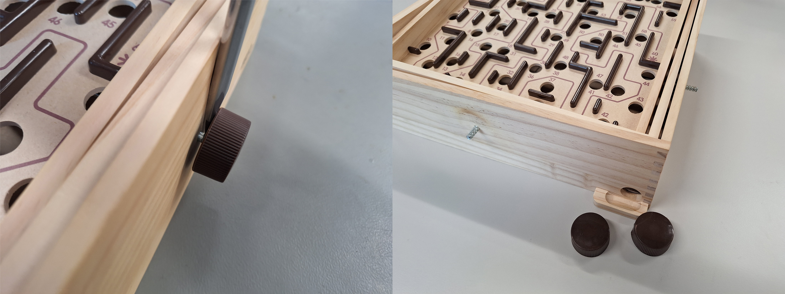
  

2. Secure the motor couplers to the motors using the provided M2x6 bolts.
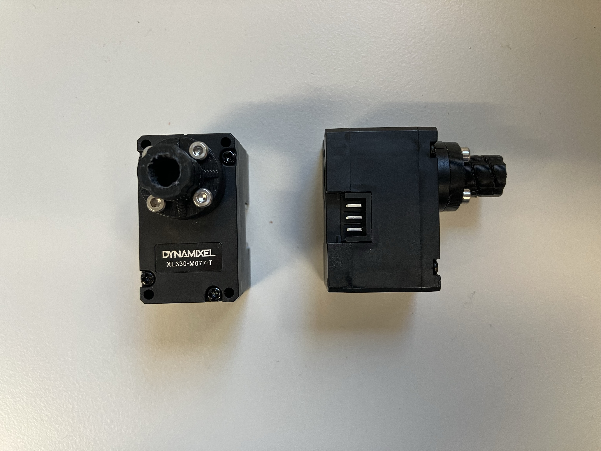
  

3. Drill pilot holes on the labyrinth to prepare for the installation of the motor housings. 
  

4. Connect the motors to the labyrinth shafts. If necessary, slightly heat the couplers with a heat gun or hair dryer to assist with the fitting. Slide the 3D-printed housings over the motors and secure the motor housings to the labyrinth with the M3x10 bolts.
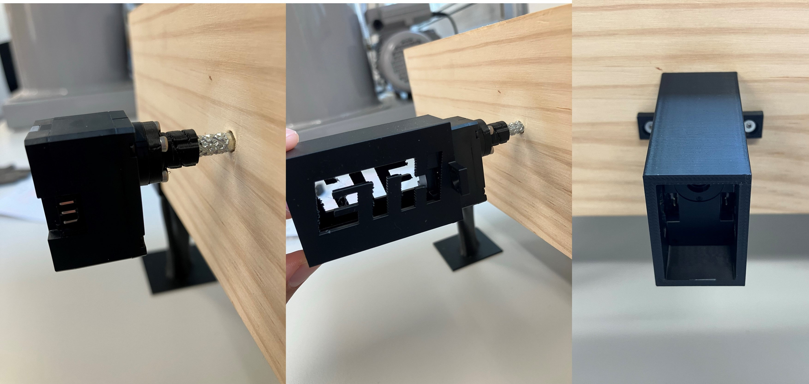
  

<!-- ###  MX-12W Motors (Option 2)

!!! warning "Disclaimer"

    The Dynamixel MX-12W motors have been discontinued. Instructions for the Dynamizel XL330-M077-T motors are above.

1. Carefully remove the two knobs from the labyrinth by using a flathead screwdriver and pressing the knobs away from the labyrinth board. Slightly heating the knobs with a heat gun or a hairdryer will facilitate this process.

  

2. Mount the motor couplers to the front of the motors using the M2x6 bolts included with the motors.
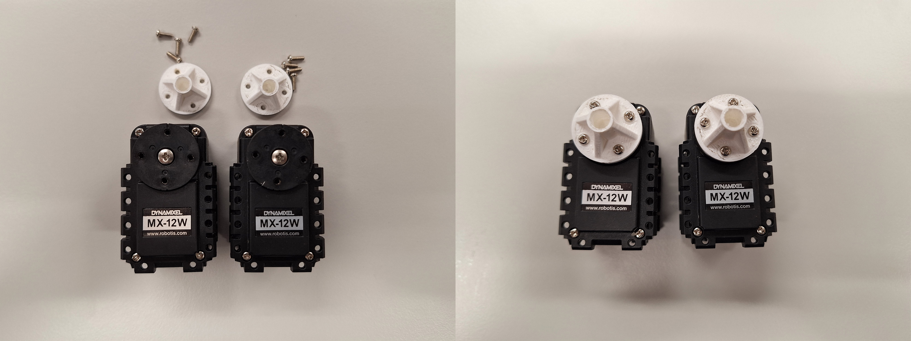
  

3. Insert the included nuts on the underside of the motors.
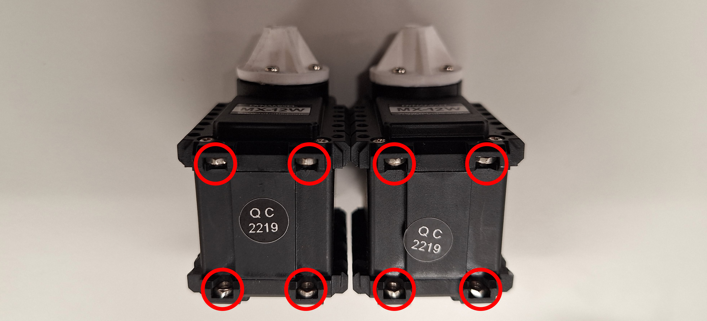
  

4. Mount the included mounting frames of the motors to the 3d-printed mounting brackets using the included M2x6 bolts and nuts.
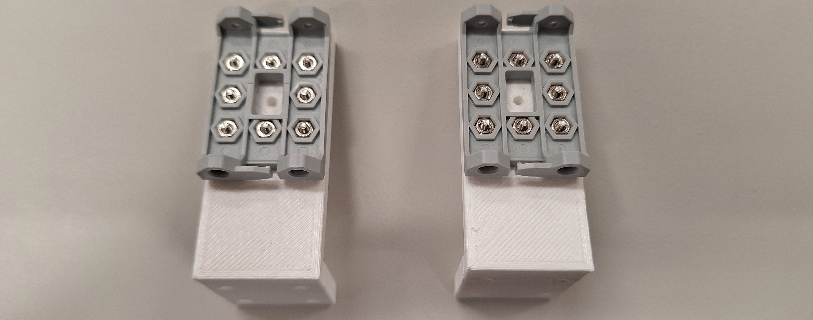
  

5. Attach the motors to the mounting frames using the included M2x6 bolts.

  

6. Press both motor couplers over the labyrinth shafts. You may need to slightly heat the couplers with a heat gun or hairdryer. Then, fix the motors to the labyrinth by using the M2.5x10 wood screws.
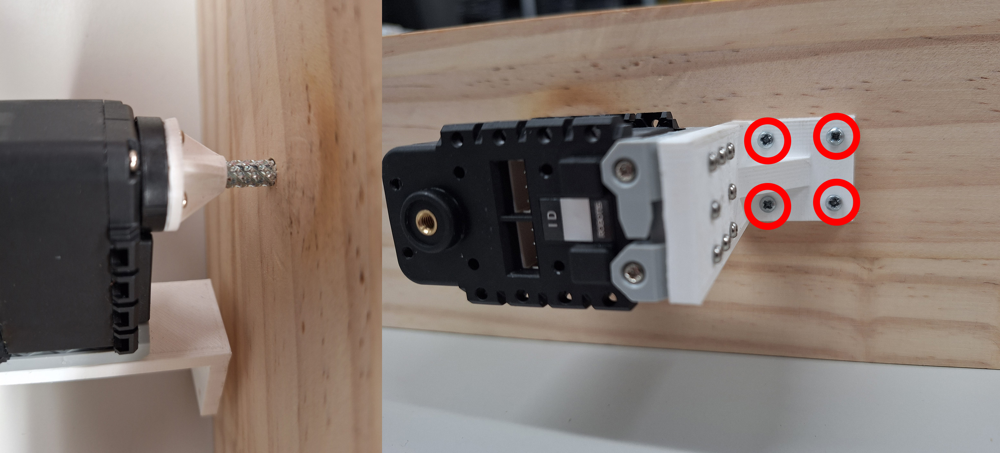 -->

### Camera

The camera has to be have a stable view of the whole labyrinth. This can be done with a scaffolding made with 2020 T-slotted Aluminum and a 3D-Printed camera mounting plate as described below.
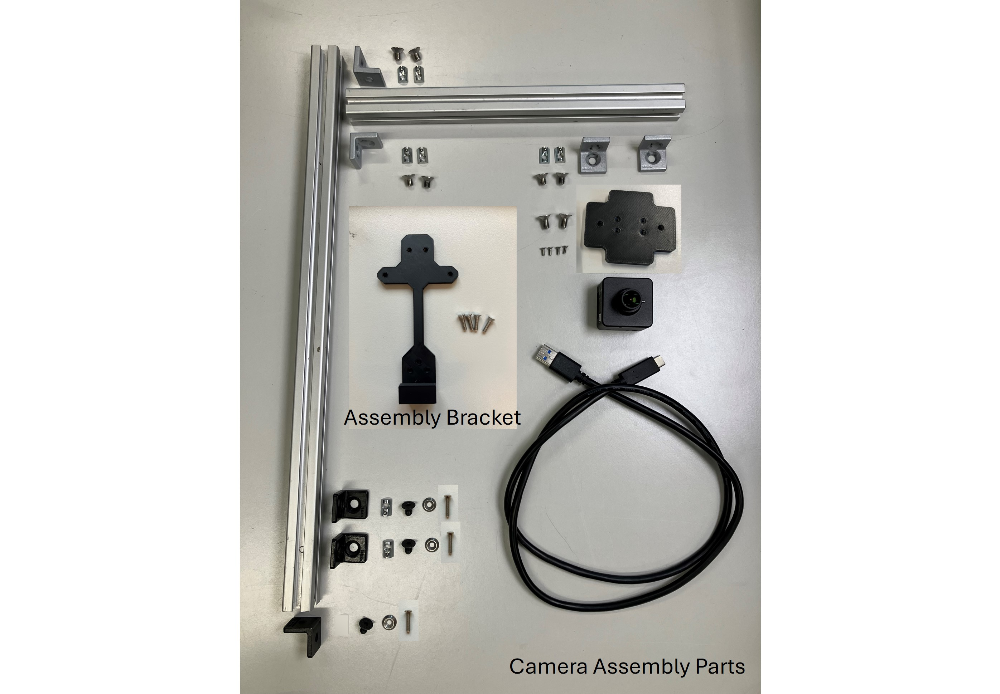

1. Tap one end of the 40 cm T-slotted aluminum to fit a M5 bolt. Mount the camera to the mounting plate with four M2x8 bolts and assmble the aluminum profiles as shown in the picture.  
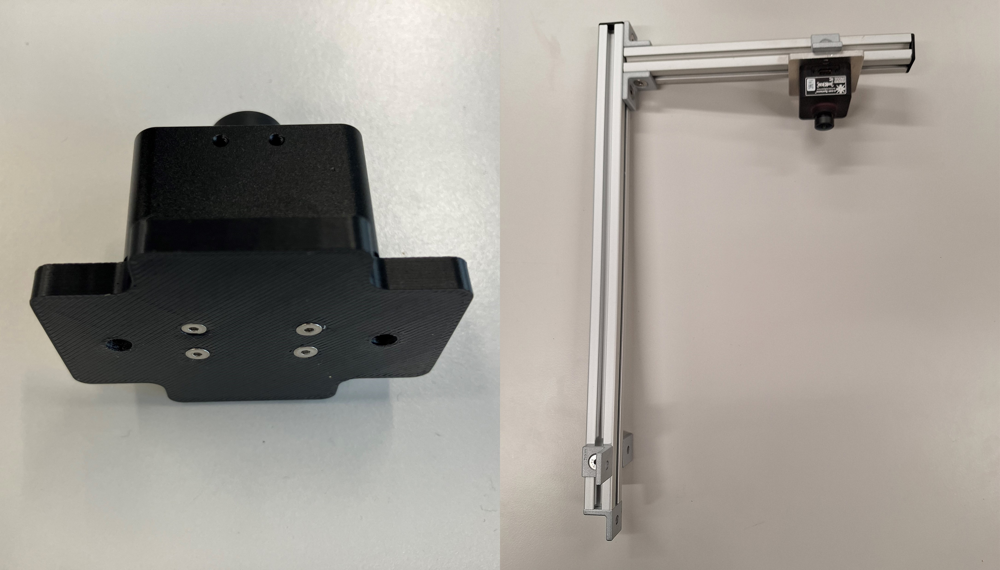
  

2. Secure the camera assembly bracket to the labyrinth using four M2.5x10 bolts. Ensure that the bracket is centered. Note that the shaft for the knob on the opposite end is not centered with respect to the playing area.

  

3. Mount the camera assembly to the labyrinth board using three M3x8 bolts and M3 washers. Adjust the height of the camera so the distance between the bottom of the lens and the labyrinth playing area is approximately 25cm.
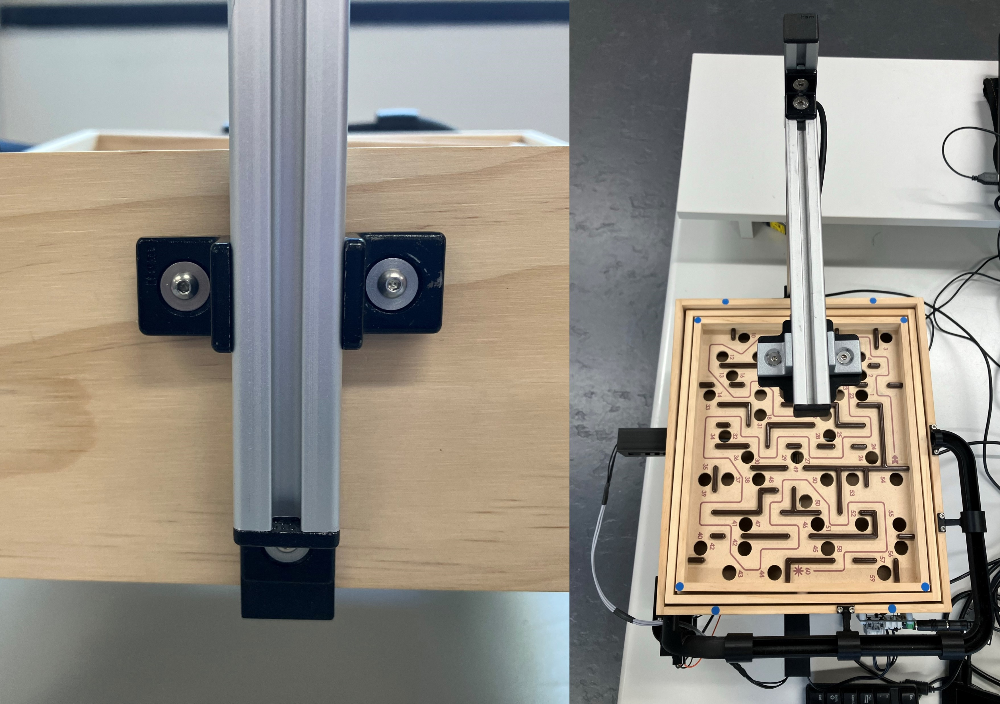 

<!-- !!! Warning

    Ensure that the wood screws do not interfere with the motion of the labyrinth playing surface!(TODO photo - also update photo with correct side of labyrinth) -->

### Calibration Markers

Next, blue markers are placed on the labyrinth to estimate the inclination angles of the labyrinth playing surface.

1. Place the first four blue labels on the center of each corners of the inner labyrinth playing surface. The labels should align with the outer edges since the diameter of the labels and the width of the edge are both 8mm. 
  
2. Place the next four blue labels on the outer perimeter of the labyrinth. The centers of each label should be 5cm from the inner edge of the external enclosure of the game along the short sides of the labyrinth, as shown in the image below.
  
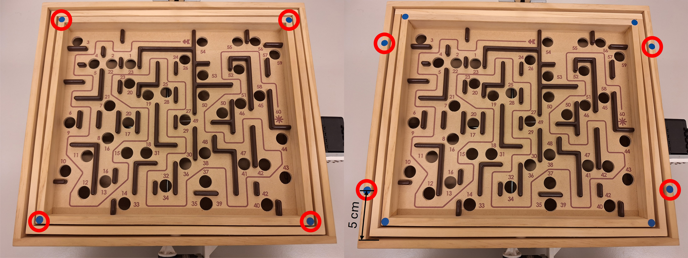

### Cabling

1. Clip the ends of two ROBOT X3P cables. Add extra wire between the corresponding pins and solder the connections. Cover the connections with heat shrink.
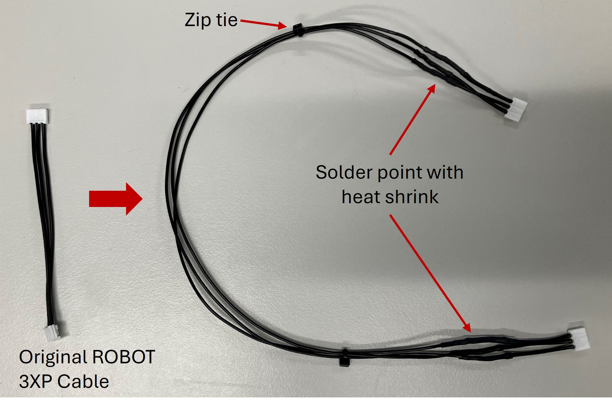
  

2. Use the extended ROBOT X3P cable to connect the motors together. Connect the motor opposite the camera scaffolding to the U2D2 with the ROBOT X3P cable from the Starter Kit. Connect the U2D2 to the Power Hub with another ROBOT X3P cable. See the <a href="https://emanual.robotis.com/docs/en/parts/interface/u2d2_power_hub/" target="_blank">U2D2 Power Hub Manual</a> for more information.

3. The U2D2 communicates the computed actions from the computer to the motors. Connect it to the computer with the USB Micro-B cable provided in the Starter Kit.

4. Connect the camera to the computer with the included USB cable.

4. Plug in the 5V Power Supply and connect it to the U2D2 Power Hub to power the motors.

!!! warning "Warning"

    The power supply in the Starter Kit is 12 V and should not be with these motors!

5. OPTIONAL: Use the included rivets and supports to secure the U2D2 and Power Hub to the side or bottom of the labyrinth. If desired, organize the cables with zip ties and zip tie mounts. 
<!-- (TODO photo) -->
